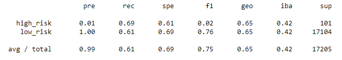
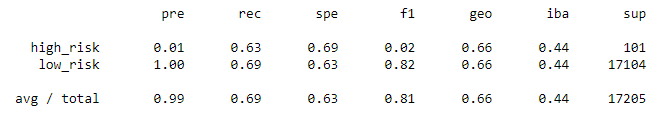
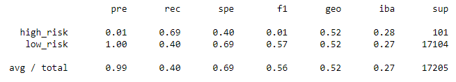
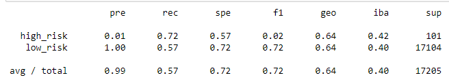
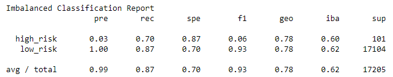
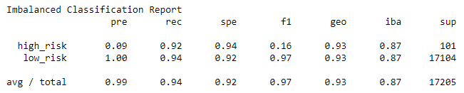

# Credit Risk Analysis

## Overview:

Using machine learning models as well as oversampling and undersampling algorithms, assess the best model to predict credit risk. Because credit risk is an inherently unbalanced classificatin problem, with good loans outnumbering the bad, different algorithms will be created, trained, and evaluated to determine the best model to predict credit risk.  A dataset from LendingClub, a peer to peer lending services company, will be used to preform the model evaluations.

## Purpose:

The following algorithms and machine learning models are created, trained, and evaluated on their prediction performance.
Since credit risk is an inherently unbalanced classification problem, the imbalanced-learn and scikit-learn libraries are used to build and evaluate the models to predict credit risk.

* Oversampling the data using the RandomOverSampler algorithm
* Oversampling the data using the SMOTE algorithm
* Undersampling the data using the ClusterCentroids algorithm
* Combinatorial approach of over- and undersampling the data using the SMOTEENN algorithm
* Machine learning model BalancedRandomForestClassifier
* Machine learning model EasyEnsembleClassifier

## Analysis Results and Challenges:

### Analysis Results

#### 1. Naive Random Oversampling

-- High risk credit card applications, results in a precision score of 1% and a recall score of 69%.

-- Low risk credit card applications, results in a precision score of 100% and a recall score of 61%.

-- For the overall total credit card applications, results in a precision score of 99% and a recall score of 61%.

-- Random oversamping algorithm results in a balanced accuracy score of: 65%.

##### Naive Random Oversampling Imbalanced Classification Report

#### 2. Synthetic Minority Oversampling Technique (SMOTE)

-- High risk credit card applications, results in a precision score of 1% and a recall score of 63%.

-- Low risk credit card applications, results in a precision score of 100% and a recall score of 69%.

-- For the overall total credit card applications, results in a precision score of 99% and a recall score of 69%.

-- SMOTE oversampling algorithm results in a balanced accuracy score of 66%.

##### SMOTE Imbalanced Classification Report

#### 3. Cluster Centroids Undersampling

-- High risk credit card applications, results in a precision score of 1% and a recall score of 69%.

-- Low risk credit card applications, results in a precision score of 100% and a recall score of 40%.

-- For the overall total credit card applications, results in a precision score of 99% and a recall score of 40%.

-- Cluster Centroids undersampling algorithm results in a balanced accuracy score of 54%.

##### Cluster Centroids Undersampling Imbalanced Classification Report

#### 4. Combination Oversampling and Undersampling with Edited Nearest Neighbors (SMOTEENN)

-- High risk credit card applications, results in a precision score of 1% and a recall score of 72%.

-- Low risk credit card applications, results in a precision score of 100% and a recall score of 57%.

-- For the overall total credit card applications, results in a precision score of 99% and a recall score of 57%.

-- SMOTEENN algorithm results in a balanced accuracy score of 64%.

##### SMOTEENN Imbalanced Classification Report

#### 5. Balanced Random Forest Classifier

-- High risk credit card applications, results in a precision score of 3% and a recall score of 70%.

-- Low risk credit card applications, results in a precision score of 100% and a recall score of 87%.

-- For the overall total credit card applications, results in a precision score of 99% and a recall score of 87%.

-- Balanced Random forest Classifier method results in a balanced accuracy score of 79%.

##### Balanced Random Forest Imbalanced Classification Report

#### 6. Easy Ensemble Adaboost Classifier

-- High risk credit card applications, results in a precision score of 9% and a recall score of 92%.

-- Low risk credit card applications, results in a precision score of 100% and a recall score of 94%.

-- For the overall total credit card applications, results in a precision score of 99% and a recall score of 94%.

-- Balanced Random forest Classifier method results in a balanced accuracy score of 93%.

##### Easy Ensemble Adaboost Imbalanced Classification Report

### Challenges and Difficulties Encountered

## Summary:

Using the different resampling algorithms with Logistic Regressions did not have significantly different performance. And all four techniques were poor performers in predicting credit risk.  Oversampling, Undersampling, or a combination of the two only produced Balanced Accuracy scores ranging from 54% to 66%. The Balanced Random Forest Classifier and the Easy Ensemble AdaBoost Classifier machine learning models significantly increased the Balanced Accuracy scores to to 79% and 93% respectively. Not only did the Easy Ensemble AdaBoost Classifier have the highest Balanced Accuracy score, but also the highest Precision and Recall for "high-risk" customers, making it the best model to proceed with the predict credit risk.
